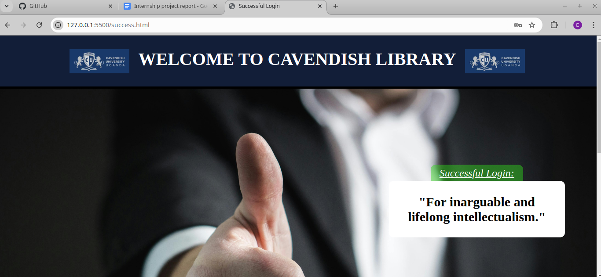

# Library Wifi Login Page for a University

This is a project for my Internship Training (Year 1) of Cavendish University. The purpose of this project is to practice whatever I have learnt in my first year as a Cavendish Student. In this project, I will be building a Wifi Login Page for anyone trying to connect to the Library's Wifi. Furthermore, this project is being built to promote awareness of the various library resources available to students and the wider community whilst also promoting rules and regulations of the library. In this project, I will using only HTML and CSS with minimal Javascript as taught in my first Year in Cavendish University.

## Table of Contents

- [Overview](#overview)
  - [Screenshot](#screenshot)
  - [Executive Summary](#executive-summary)
  - [Problem Statement](#problem-statement)
  - [Objectives](#objectives)
  - [Methodology](#methodology)
  - [Flow](#flow)
  - [Features of the Solution](#features-of-the-solution)
- [Code Presentation](#code-presentation)
  - [Sample Code Snippet (Javascript)](#sample-code-snippet-javascript)
- [Resources Used](#resources)
- [Conclusion and Recommendations](#conclusion-and-recommendations)
  - [Learning Outcomes](#learning-outcomes)
  - [Recommendations](#recommendations)

## Overview

### Screenshot

**Homepage**

**Success Page**

**Failure Page**

### Executive Summary

This project aims to improve Cavendish Library’s effectiveness by creating a WiFi login page. The page promotes awareness of library rules and resources while ensuring users interact with guidelines before accessing WiFi. Technologies used include HTML, CSS, and JavaScript.

### Problem Statement:

Current WiFi access allows users to log in without understanding library rules or resources, leading to underutilization and misuse of services.

### Objectives:

- Design a user-friendly login page displaying library rules and resources.
- Ensure students acknowledge policies before WiFi access.
- Promote tools like LibHub, KOHA, and CUU resources.

### Methodology:

- Designed the UI using Figma.
- Set up a GitHub repository for version control.
- Implemented a login system using HTML, CSS, and JavaScript.
- Developed success and failure pages for login validation.

### Flow:

User Input - Login Validation - Success/Failure page

### Features of the Solution

- Login form with validation.
- Display of library rules and resources.
- Redirection to success/failure pages based on login.

## Code Presentation

**Login Page:** Contains fields for username and password, rules display, and resource highlights.

**JavaScript Validation:** Ensures correct credentials before granting WiFi access.

### Sample Code Snippet (Javascript):

        function validateLogin(event) {
            event.preventDefault();
                const username = document.getElementById('username').value;
                const password = document.getElementById('password').value;
                if (username === "Library" && password === "library123") {
                window.location.href = "success.html";
                } else {
                window.location.href = "failure.html";
                }
        }

## Resources

- [Figma](https://www.figma.com/) - This helped me for CSS flexbox. I really liked the detailed information and clarity and will use it going forward.
- [Coolors] (https://coolors.co/) - This helped me for everything, from HTML, CSS to understanding GIT, Github and linux installation.
- [Pexels](https://www.pexels.com/) - This is an amazing resource which helped me to quickly understand the basics of HTML and CSS. I'd recommend it to anyone anxious to learn web development.

**Colors Used**

| Component                       | Code                    |
| ------------------------------- | ----------------------- |
| Header                          | #121E38                 |
| Text                            | #FFFFFF                 |
| Body-Head, Button & Footer-Head | #213769                 |
| Body-Body                       | rgba(33, 55, 105, 0.74) |
| Border-color                    | #000000                 |

## Conclusion and Recommendations

### Learning Outcomes

This project provided valuable lessons and opportunities for overcoming obstacles. I specifically learned the importance of patience in achieving quality and efficient work, resisting the temptation to rush despite time constraints. I also developed a more analytical and open approach to problem-solving, particularly when addressing challenges with styling components. A significant challenge I successfully navigated was balancing the need for a simple university Wi-Fi login design with the requirement to promote awareness of Library rules, regulations, and resources.

### Recommendations

This solution ensures users are informed of library rules and resources, encouraging responsible usage. Future enhancements could include a "Report Issue" button for noise complaints with desk-specific details.
